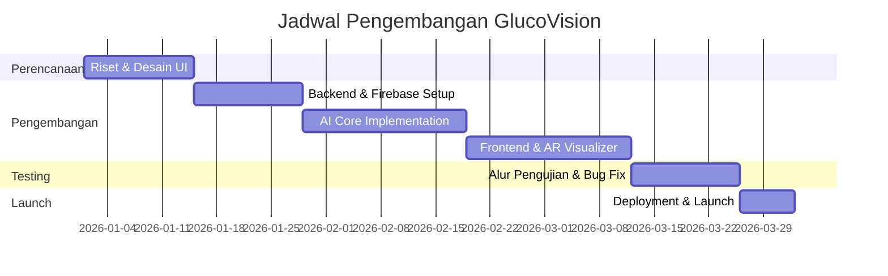

# DOKUMENTASI SISTEM GLUCOVISION

Dokumen ini berisi analisis mendalam, perancangan diagram, estimasi anggaran, dan rencana pengembangan untuk sistem **GlucoVision**.

---

## 1. USE CASE & ACTIVITY DIAGRAM

### 1.1. Use Case Diagram
Diagram ini menggambarkan interaksi antara pengguna (User) dengan fungsi-fungsi utama dalam sistem GlucoVision.

```mermaid
useCaseDiagram
    actor "Pengguna (User)" as U
    actor "Sistem AI (Luco)" as L

    package GlucoVision {
        usecase "Melakukan Registrasi/Login" as UC1
        usecase "Pengukuran Non-Invasif" as UC2
        usecase "Konsultasi dengan Luco AI" as UC3
        usecase "Visualisasi Gula (AR)" as UC4
        usecase "Melihat Dashboard & Riwayat" as UC5
        usecase "Unggah Dokumen Lab" as UC6
    }

    U --> UC1
    U --> UC2
    U --> UC3
    U --> UC4
    U --> UC5
    U --> UC6

    UC3 <--> L : Memberikan Asistensi
    UC2 --> L : Analisis Data PPG
```

### 1.2. Activity Diagram: Proses Pengukuran
Diagram ini menunjukkan langkah-langkah sistem saat pengguna melakukan pengukuran gula darah non-invasif.

```mermaid
activityDiagram
    start
    :User membuka halaman Pengukuran;
    :Sistem meminta akses Kamera;
    if (Akses diberikan?) then (Ya)
        :Membuka Stream Kamera;
        :Deteksi Wajah/Jari (Face Mesh);
        while (Proses Scanning (30 detik)) is (Berjalan)
            :Ekstraksi Sinyal PPG;
            :Validasi Stabilitas Cahaya;
        endwhile
        :Kirim Sinyal ke Model AI;
        :Prediksi BPM & Estimasi Gula;
        :Tampilkan Hasil di Layar;
        :Simpan ke Dashboard;
    else (Tidak)
        :Tampilkan Pesan Error;
    endif
    stop
```

> [!TIP]
> **Cara Pembuatan Diagram**: Diagram di atas dibuat menggunakan sintaks **Mermaid.js**. Anda bisa mengeditnya langsung di markdown atau menggunakan [Mermaid Live Editor](https://mermaid.live/) untuk melihat perubahan secara real-time.

---

## 2. ANALISIS SISTEM

### 3.2.1. STAKEHOLDER
Identifikasi pihak-pihak yang terlibat dalam ekosistem GlucoVision:
1.  **Pengguna Utama**: Individu penderita diabetes atau mereka yang ingin menjaga kadar gula darah tanpa rasa sakit.
2.  **Tenaga Medis (Dokter/Lab)**: Pihak yang datanya (hasil lab) diunggah pengguna untuk manajemen kesehatan yang lebih terintegrasi.
3.  **Administrator Sistem**: Mengelola keamanan data Firebase dan pemeliharaan model AI.
4.  **Institusi Kesehatan (Partner)**: Pihak yang bekerja sama untuk validasi klinis (Kemenkes, BPJS, IDI).

### 3.2.2. FUNGSI ATAU FITUR SISTEM
*   **Core Measurement Engine**: Algoritma visi komputer untuk mengekstraksi data kesehatan tanpa kontak fisik.
*   **Luco AI Assistant**: Chatbot responsif yang mampu menjawab pertanyaan medis dasar dan memberikan motivasi harian.
*   **Sugar Visualizer 3D**: Antarmuka interaktif yang merepresentasikan organ tubuh dan interaksinya dengan molekul gula.
*   **Digital Lab Archive**: Sistem penyimpanan dokumen medis terenkripsi.

### 3.2.3. ALUR PROSES
1.  **Onboarding**: User masuk -> Login -> Pengisian profil dasar.
2.  **Monitoring**: User memilih fitur pengukuran -> Menunggu proses scan -> Hasil muncul.
3.  **Insight**: User berkonsultasi dengan Luco AI mengenai hasil tersebut.
4.  **Action**: User melihat visualisasi AR untuk memahami bahaya jika kadar gula tidak terkontrol.
5.  **Tracking**: Semua aktivitas tercatat di Dashboard untuk pemantauan jangka panjang.

### 3.2.4. DATA DAN OUTPUT SISTEM
*   **Data Input**: Video stream (raw frame), Biodata User, File hasil Lab (PDF/PNG), Query chat.
*   **Data Output**: Nilai BPM (Heart Rate), Estimasi Tren Glukosa, Laporan harian/bulanan, Grafik visual.

---

## 3. RINCIAN KEBUTUHAN ANGGARAN (Estimasi)

| Komponen | Deskripsi | Estimasi Biaya |
| :--- | :--- | :--- |
| **Infrastruktur Cloud** | Firebase (Auth, DB, Hosting, ML Kit) | Rp 750.000 / bln |
| **Model AI Training** | Compute Resource (GPU) untuk Latih Model | Rp 3.000.000 |
| **Pengembangan Perangkat Lunak** | Tim Dev (UI/UX, Frontend, AI Engineer) | Rp 150.000.000 |
| **Integrasi & API** | Lisensi API pihak ketiga jika diperlukan | Rp 2.500.000 |
| **Pemasaran & Validasi** | Iklan & Validasi Klinis Dasar | Rp 15.000.000 |
| **TOTAL TAHUNAN** | (Infrastruktur x 12 + Biaya Dev & Awal) | **Rp 179.500.000** |

---

## 4. TIMELINE PEMBUATAN (12 Minggu)



---

## 5. TAMPILAN SISTEM

1.  **Landing Page**: Menggunakan desain minimalis dengan *hero section* interaktif dan navigasi logistik yang bersih.
2.  **Luco Section**: Antarmuka berbasis video interaktif yang menunjukkan asisten AI sedang dalam posisi *idle* atau merespon user.
3.  **Problem Cards**: Tampilan kartu penuh (full card) dengan *overlay* teks yang menjelaskan keresahan penderita diabetes (Sakit, Biaya, Infeksi).
4.  **Dashboard**: Layout Bento Grid yang menampilkan widget statistik kesehatan secara dinamis.

---
*Dibuat oleh Tim Pengembang GlucoVision - 2026*
